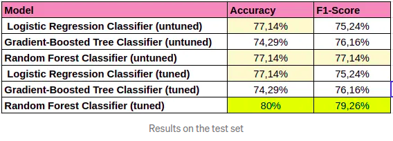

# Sparkify
This project is part of the Udacity Nanodegree Course: Data Scientist - Capstone

The project analyses user behavior on Sparkify (fictional music streaming service) and implements classification 
algorithms using Apache Spark framework to predict user churn.

Implemented classification methods:

1. Logistic Regression Classifier
2. Gradient-Boosted Tree Classifier 
3. Random Forest Classifier

The full project report can be fined in this blog-post: 
https://medium.com/@ivanadaskalovska/predicting-user-churn-with-machine-learning-on-apache-spark-d556f61338ab

## Installation 

You can install this repository on your pc by using:
```
git clone git@github.com:Ivana-DS/Sparkify.git
```
Python version: 3.8.10

Jupyter Notebook version: 6.4.6

You also need to install the requirements file:
```
pip install -r requirements.txt
```
And you need to unpack the example training data.

```
gunzip mini_sparkify_event_data.json.gz
```

## Files

1. trained_models: Repository containing all the models which were trained during this project.  
2. Sparkify.ipynb: The jupyter notebook which contains the cleaning process and the analyses made on the Google Playstore Dataset
2. mini_sparkify_event_data.json : The data set used for the analysis. (gzipped)
3. requirements.txt: Contains all the libraries needed to work with this project.

## Usage

After installing the requirements you just have to start Jupyter Notebook in your bash by using:
```
jupyter-notebook
```
Then folow the instructions in the terminal, you will be provided with a link for opening the notebook in the browser. 

## Summary of results

The results we achieved are presented in the following table:



As we can see here, on the test set we acieved the best performans with the tuned Random Forest Classifier: 
80% accuracy and 79,26% f1-score.